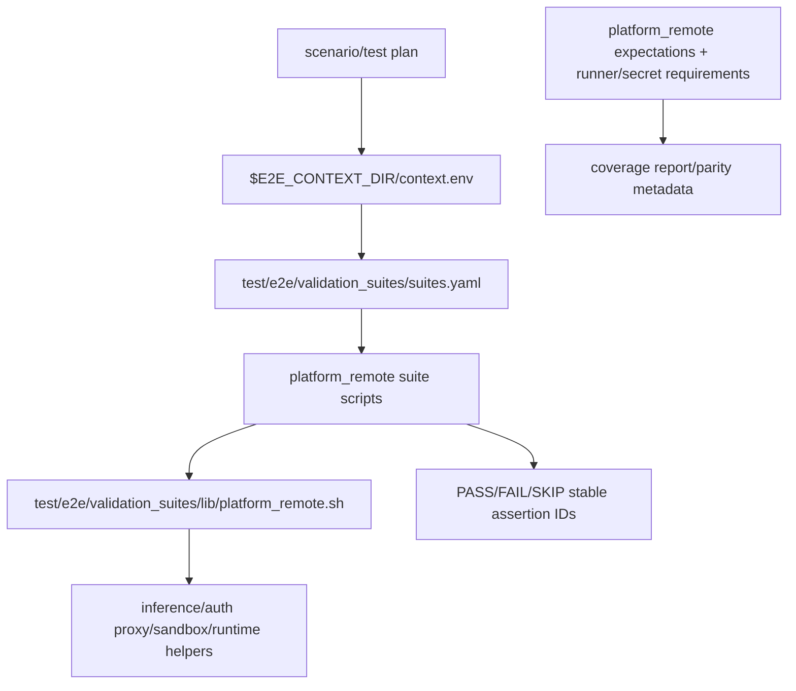

# Specification: Issue #3816 — Platform/Remote Scenario Suite Migration

Issue: #3816
Parent epic: #3588
Assertion inventory source: <https://github.com/NVIDIA/NemoClaw/issues/3816#issuecomment-4544670144>
Related items evaluated: #3975, #4178, #4113, #4114, #3989, #3974, #3986, #3988, #4177, PR #4008, #3473, #3710, PR #3965, PR #3963, #3959, PR #3960, PR #4214, PR #4046, PR #4038, PR #4039.

## Overview & Objectives

Migrate `platform-remote` E2E coverage into the layered scenario framework without porting legacy scripts line-for-line. The implementation must extract stable platform/remote behaviors, add a shared primitive layer, represent every assertion from the #3816 assertion inventory, and preserve platform/runner/secret metadata for GPU, Brev, DGX Spark, macOS, WSL, `NVIDIA_API_KEY`, Jetson/manual, and other deferred environments.

Objectives:

- Add `test/e2e/validation_suites/lib/platform_remote.sh` as the shared primitive layer.
- Add suite families under `test/e2e/validation_suites/platform_remote/` and `test/e2e/validation_suites/suites.yaml`.
- Wire scenario/test-plan metadata in `test/e2e/nemoclaw_scenarios/scenarios.yaml`.
- Use stable assertion IDs in the `expected.platform_remote.<family>.<behavior>` namespace.
- Preserve `run-scenario.sh <id> --plan-only` compatibility for every new or changed scenario.
- Represent every assertion below as exactly one of `covered`, `new assertion`, `deferred`, or `retired`.
- Capture parity/coverage metadata through the current scenario coverage/reporting mechanism; if `test/e2e/docs/parity-map.yaml` still exists on the target branch, update it with `layer`, `gap_domain`, `owner`, runner requirements, and secret requirements.

**Review guardrail: do NOT simplify assertion coverage during review.** The inventory rows below are intentionally granular; reviewers may ask for better grouping in code, but the spec/metadata must continue to preserve one row per assertion from the inventory comment and every added issue-body item.

## Scope

`platform-remote` covers E2E behaviors tied to platform-specific or remote execution paths:

- GPU/local Ollama host flows.
- Ollama auth proxy persistence, permissions, topology, and recovery.
- Brev CPU/GPU remote branch validation and launchable install flows.
- DGX Spark / DGX Station style local-model hosts.
- macOS and Windows/WSL workflow/platform execution paths.
- OpenShell Docker-driver gateway/network topology where it differs by platform.
- Platform-specific install/onboard preflight and recovery behavior.
- Public installer target-ref behavior from PR #4214 because it affects remote/platform workflow correctness.

Out of scope unless explicitly listed in the inventory: messaging-provider behavior, generic policy presets, generic negative-path onboarding, non-platform-specific CLI parsing, and harness-only setup details.

## Architecture Design

### Layering Model

### Domain Primitive Library

Create `test/e2e/validation_suites/lib/platform_remote.sh` with context-driven helpers. Suites must consume `$E2E_CONTEXT_DIR/context.env`; they must not reinstall, onboard, or rediscover setup state.

Design alignment:

- Source and wrap the existing runtime/suite primitives (`test/e2e/runtime/lib/context.sh`, `test/e2e/runtime/lib/env.sh`, `test/e2e/runtime/lib/logging.sh` through `env.sh`, and `test/e2e/validation_suites/sandbox-exec.sh`) instead of creating a parallel context, logging, dry-run, or redaction implementation.
- Use `e2e_context_require`, `e2e_context_get`, `e2e_context_dump`, `e2e_env_is_dry_run`, `e2e_section`, `e2e_pass`, and `e2e_fail` for the underlying behavior; `e2e_platform_remote_*` helpers should be thin domain wrappers that add platform/remote assertion IDs and metadata.
- Keep suite steps as small shell scripts under `test/e2e/validation_suites/platform_remote/` that delegate shared behavior to `platform_remote.sh`.

Required helper families:

- Context, metadata, and redaction:
  - `e2e_platform_remote_load_context`
  - `e2e_platform_remote_assertion`
  - `e2e_platform_remote_skip`
  - `e2e_platform_remote_require_context_keys`
  - `e2e_platform_remote_require_secret_metadata`
  - `e2e_platform_remote_redact`
- Prerequisites and platform guards:
  - Docker daemon, Linux, macOS, WSL, GPU, DGX Spark, Jetson/Tegra, Brev, network reachability, non-interactive env vars.
- GPU/Ollama:
  - GPU proof logs, Ollama lifecycle, Ollama route config, model availability, direct and sandbox inference.
- Ollama auth proxy:
  - token existence, mode `600`, unauthenticated rejection, bearer acceptance, topology reachability, recovery from persisted token.
- Launchable/Brev:
  - launchable artifacts, sentinel, CLI/OpenShell availability, cloud route, agent-mediated inference, remote registry shape, suite dispatch output, GPU runtime/network preparation.
- DGX Spark / local-model hosts:
  - install smoke, aarch64 gateway health semantics, old Ollama upgrade path, available-memory model selection, sudo-free user-local install fallback, GPU recreate command preservation.
- WSL/macOS:
  - workflow metadata, WSL bootstrap, OpenShell source-install bootstrap, idle gateway recovery, fake-GPU rejection.
- Jetson/manual:
  - NVIDIA runtime path, forced-GPU fail-fast guidance, manual/deferred metadata.
- Public installer target ref:
  - public install source isolation, requested ref evidence, toolchain availability.

### Suite Organization

Add suite entries in `test/e2e/validation_suites/suites.yaml`:

| Suite ID | Purpose | Primary scenario/test plan |
| --- | --- | --- |
| `platform-remote-gpu-ollama` | GPU host prerequisite, install/onboard output, GPU proof, local Ollama inference | `gpu-repo-local-ollama-openclaw` |
| `platform-remote-ollama-proxy` | auth proxy token, permissions, auth behavior, recovery, topology | `gpu-repo-local-ollama-openclaw` |
| `platform-remote-gpu-cleanup` | destroy/uninstall cleanup semantics | `gpu-repo-local-ollama-openclaw` |
| `platform-remote-gpu-reonboard` | double onboard token consistency regression | `gpu-repo-local-ollama-openclaw-reonboard` |
| `platform-remote-launchable` | Brev launchable/community install smoke | `brev-launchable-cloud-openclaw` |
| `platform-remote-brev-branch` | Brev remote branch validation, suite dispatch, GPU runtime prep | `brev-remote-branch-validation` |
| `platform-remote-spark-install` | DGX Spark/Linux install smoke | `dgx-spark-repo-install` |
| `platform-remote-spark-runtime` | DGX Spark local-model runtime fixes | `dgx-spark-repo-local-ollama-openclaw` |
| `platform-remote-macos` | macOS workflow/platform metadata | `macos-repo-cloud-openclaw` |
| `platform-remote-wsl` | WSL platform/source-install/recovery/fake-GPU behavior | `wsl-repo-cloud-openclaw` and WSL negative plans |
| `platform-remote-public-install` | public cloud onboard target-ref install | `ubuntu-public-cloud-openclaw-target-ref` |
| `platform-remote-jetson` | Jetson GPU backend and forced-GPU guidance | `jetson-repo-local-openclaw` (manual/deferred) |
| `platform-remote-metadata` | workflow-only metadata such as PR #4046 | coverage metadata only |

### Scenario and Runner Metadata

Add or extend these scenarios/test plans:

| Scenario/test plan | Runner/platform | Secrets | Expected live status |
| --- | --- | --- | --- |
| `gpu-repo-local-ollama-openclaw` | self-hosted NVIDIA GPU Linux runner, Docker CDI/NVIDIA runtime, `nvidia-smi` | none for Ollama local path | pass when runner available; deferred otherwise |
| `gpu-repo-local-ollama-openclaw-reonboard` | same as GPU scenario | none | pass when runner available; deferred otherwise |
| `brev-launchable-cloud-openclaw` | Ubuntu GitHub runner provisioning Brev CPU launchable | `NVIDIA_API_KEY`, Brev token/API auth if launchable provisioner requires it | pass on internal PR branch when secrets available; skip/deferred if secrets unavailable |
| `brev-remote-branch-validation` | Ubuntu runner with Brev provisioning capability | Brev token/API auth; optional `NVIDIA_API_KEY` for cloud selected suites | pass for CPU/source-shape; GPU bridge live portion deferred until GPU Brev resources available/#3959 closes |
| `dgx-spark-repo-install` | DGX Spark / aarch64 Linux manual or self-hosted runner | none for install smoke | deferred/manual until runner exists; plan-only must pass |
| `dgx-spark-repo-local-ollama-openclaw` | DGX Spark / DGX Station local-model host | none unless model pull needs network auth | deferred/manual until runner exists; plan-only must pass |
| `macos-repo-cloud-openclaw` | `macos-26` or current macOS runner | `NVIDIA_API_KEY` only for cloud live suites | metadata/platform smoke pass; Docker-dependent suites skipped on GitHub-hosted macOS |
| `wsl-repo-cloud-openclaw` | `windows-latest` with WSL2 Ubuntu 24.04 | `NVIDIA_API_KEY` only for cloud live suites | pass for WSL setup/platform smoke; Docker/cloud checks skip if unavailable with explicit reason |
| `wsl-no-distro-bootstrap-negative` | Windows ARM/manual or `windows-latest` fixture | none | negative assertion passes by expecting install/register or actionable failure |
| `wsl-fake-gpu-negative` | WSL fixture/manual | none | negative assertion passes by expecting NVIDIA GPU preflight rejection |
| `ubuntu-public-cloud-openclaw-target-ref` | Ubuntu runner | `NVIDIA_API_KEY` | pass on PR branch with target ref evidence |
| `jetson-repo-local-openclaw` | Jetson/Tegra manual/self-hosted | none | deferred/manual; forced-GPU negative assertion must fail-fast when manually run |

## Assertion Coverage Inventory

Classification vocabulary is exactly: `covered`, `new assertion`, `deferred`, `retired`.

- `covered`: existing legacy behavior to migrate into scenario suites or existing scenario behavior that remains in scope.
- `new assertion`: explicit assertion/metadata added by #3816 because the issue/comment identified a gap or newer platform fix.
- `deferred`: in scope but cannot be made live-green on default PR infrastructure; metadata and plan-only coverage are still required.
- `retired`: harness-only, duplicate, obsolete, or out-of-domain assertion; must still be represented in coverage metadata with rationale.

### `test/e2e/test-gpu-e2e.sh` → GPU/local Ollama end-to-end

| Assertion | Classification | Stable assertion ID | Scenario / test plan / suite | Runner/platform/secret metadata | Rationale |
| --- | --- | --- | --- | --- | --- |
| Pre-cleanup complete | retired | — | metadata only | GPU Linux; no secret | Harness setup, not product behavior. |
| Docker is running | new assertion | `expected.platform_remote.prereq.docker-running.gpu` | `gpu-repo-local-ollama-openclaw` / `platform-remote-gpu-ollama` | self-hosted GPU Linux; Docker | Explicit prerequisite metadata gap. |
| `nvidia-smi` works and reports VRAM | covered | `expected.platform_remote.prereq.nvidia-smi-vram` | `gpu-repo-local-ollama-openclaw` / `platform-remote-gpu-ollama` | self-hosted NVIDIA GPU; no secret | Core GPU host prerequisite. |
| `NEMOCLAW_NON_INTERACTIVE=1` required | new assertion | `expected.platform_remote.prereq.non-interactive-env.gpu` | `gpu-repo-local-ollama-openclaw` / onboarding assertion | GPU Linux; no secret | Explicit non-interactive contract. |
| `NEMOCLAW_ACCEPT_THIRD_PARTY_SOFTWARE=1` required | new assertion | `expected.platform_remote.prereq.third-party-acceptance.gpu` | `gpu-repo-local-ollama-openclaw` / onboarding assertion | GPU Linux; no secret | Explicit third-party install contract. |
| Ollama already installed / Ollama installed | covered | `expected.platform_remote.gpu.ollama-binary-available` | `gpu-repo-local-ollama-openclaw` / `platform-remote-gpu-ollama` | GPU Linux; network/model pull as needed | Stable host Ollama availability. |
| Existing Ollama service stopped / port freed | covered | `expected.platform_remote.gpu.ollama-port-owned` | `gpu-repo-local-ollama-openclaw` / `platform-remote-gpu-ollama` | GPU Linux | Onboard owns local Ollama lifecycle. |
| repo root exists / cd succeeds | retired | — | metadata only | none | Harness-only checkout assertion. |
| `install.sh --non-interactive` exits 0 | covered | `expected.platform_remote.gpu.install-noninteractive-ollama` | `gpu-repo-local-ollama-openclaw` / setup expected state | GPU Linux | Install + onboard succeeds with Ollama. |
| `nemoclaw` on PATH after install | covered | `expected.platform_remote.gpu.cli-on-path` | `gpu-repo-local-ollama-openclaw` / `platform-remote-gpu-ollama` | GPU Linux | Installed CLI discoverable. |
| `nemoclaw list` contains sandbox | covered | `expected.platform_remote.gpu.sandbox-listed` | `gpu-repo-local-ollama-openclaw` / `platform-remote-gpu-ollama` | GPU Linux | Registry/list visibility. |
| `nemoclaw <sandbox> status` exits 0 | covered | `expected.platform_remote.gpu.sandbox-status-healthy` | `gpu-repo-local-ollama-openclaw` / `platform-remote-gpu-ollama` | GPU Linux | Sandbox health. |
| status says `Sandbox GPU: enabled` | covered | `expected.platform_remote.gpu.sandbox-gpu-enabled` | `gpu-repo-local-ollama-openclaw` / `platform-remote-gpu-ollama` | GPU Linux | GPU mode enabled on NVIDIA host. |
| install log has `GPU proof passed: nvidia-smi when available` | covered | `expected.platform_remote.gpu.proof-nvidia-smi` | `gpu-repo-local-ollama-openclaw` / `platform-remote-gpu-ollama` | GPU Linux | Onboard GPU proof. |
| install log has `/proc/<pid>/task/<tid>/comm write` proof | covered | `expected.platform_remote.gpu.proof-proc-comm-write` | `gpu-repo-local-ollama-openclaw` / `platform-remote-gpu-ollama` | GPU Linux | Runtime compatibility proof. |
| install log has `cuInit(0)` proof | covered | `expected.platform_remote.gpu.proof-cuinit` | `gpu-repo-local-ollama-openclaw` / `platform-remote-gpu-ollama` | GPU Linux | CUDA init proof. |
| `openshell inference get` includes Ollama | covered | `expected.platform_remote.gpu.inference-provider-ollama` | `gpu-repo-local-ollama-openclaw` / `platform-remote-gpu-ollama` | GPU Linux | Provider route configured. |
| Ollama reachable at `127.0.0.1:11434` | covered | `expected.platform_remote.gpu.ollama-localhost-reachable` | `gpu-repo-local-ollama-openclaw` / `platform-remote-gpu-ollama` | GPU Linux | Local Ollama liveness. |
| proxy token exists at `~/.nemoclaw/ollama-proxy-token` | covered | `expected.platform_remote.ollama_proxy.token-exists` | `gpu-repo-local-ollama-openclaw` / `platform-remote-ollama-proxy` | GPU Linux | Persisted auth token. |
| proxy token permissions are `600` | covered | `expected.platform_remote.ollama_proxy.token-mode-600` | `gpu-repo-local-ollama-openclaw` / `platform-remote-ollama-proxy` | GPU Linux | Token hardening. |
| auth proxy answers on proxy port | covered | `expected.platform_remote.ollama_proxy.liveness` | `gpu-repo-local-ollama-openclaw` / `platform-remote-ollama-proxy` | GPU Linux | Auth proxy liveness. |
| unauthenticated POST returns `401` | covered | `expected.platform_remote.ollama_proxy.rejects-unauthenticated` | `gpu-repo-local-ollama-openclaw` / `platform-remote-ollama-proxy` | GPU Linux | Protected calls require auth. |
| correct bearer token returns non-401 | covered | `expected.platform_remote.ollama_proxy.accepts-persisted-token` | `gpu-repo-local-ollama-openclaw` / `platform-remote-ollama-proxy` | GPU Linux | Valid token accepted. |
| Docker bridge proxy reachability skipped under Docker GPU patch | new assertion | `expected.platform_remote.ollama_proxy.docker-gpu-topology-skip` | `gpu-repo-local-ollama-openclaw` / `platform-remote-ollama-proxy` | GPU Linux Docker topology | Explicit conditional skip semantics. |
| container reaches `host.openshell.internal:<proxy>` | covered | `expected.platform_remote.ollama_proxy.container-host-reachable` | `gpu-repo-local-ollama-openclaw` / `platform-remote-ollama-proxy` | GPU Linux Docker bridge | Container-to-host proxy reachability. |
| killed proxy is actually dead | covered | `expected.platform_remote.ollama_proxy.kill-precondition` | `gpu-repo-local-ollama-openclaw` / `platform-remote-ollama-proxy` | GPU Linux | Recovery precondition. |
| proxy recovers from persisted token | covered | `expected.platform_remote.ollama_proxy.recovers-from-persisted-token` | `gpu-repo-local-ollama-openclaw` / `platform-remote-ollama-proxy` | GPU Linux | Proxy recovery behavior. |
| recovered proxy accepts original persisted token | covered | `expected.platform_remote.ollama_proxy.recovered-accepts-original-token` | `gpu-repo-local-ollama-openclaw` / `platform-remote-ollama-proxy` | GPU Linux | Token consistency after recovery. |
| proxy recovery skipped when PID/token unavailable | new assertion | `expected.platform_remote.ollama_proxy.recovery-skip-metadata` | `gpu-repo-local-ollama-openclaw` / `platform-remote-ollama-proxy` | GPU Linux | Explicit skip/deferred metadata. |
| model exists in Ollama | covered | `expected.platform_remote.gpu.ollama-model-available` | `gpu-repo-local-ollama-openclaw` / `platform-remote-gpu-ollama` | GPU Linux; model/network | Model availability. |
| direct host Ollama chat returns `PONG` | covered | `expected.platform_remote.gpu.direct-ollama-chat-pong` | `gpu-repo-local-ollama-openclaw` / `platform-remote-gpu-ollama` | GPU Linux | Direct local inference. |
| sandbox inference via configured route returns `PONG` | covered | `expected.platform_remote.gpu.sandbox-inference-local-pong` | `gpu-repo-local-ollama-openclaw` / `platform-remote-gpu-ollama` | GPU Linux | Sandbox route to Ollama. |
| sandbox removed from registry after destroy | covered | `expected.platform_remote.cleanup.destroy-removes-sandbox.gpu` | `gpu-repo-local-ollama-openclaw` / `platform-remote-gpu-cleanup` | GPU Linux | Destroy cleanup correctness. |
| uninstall skipped with `SKIP_UNINSTALL=1` | retired | — | metadata only | none | Debug harness skip, not domain behavior. |
| `uninstall.sh --delete-models` exits 0 | covered | `expected.platform_remote.cleanup.uninstall-delete-models` | `gpu-repo-local-ollama-openclaw` / `platform-remote-gpu-cleanup` | GPU Linux | Ollama-aware uninstall succeeds. |
| `~/.nemoclaw` removed | covered | `expected.platform_remote.cleanup.nemoclaw-state-removed` | `gpu-repo-local-ollama-openclaw` / `platform-remote-gpu-cleanup` | GPU Linux | Uninstall deletes state. |
| cleanup complete | retired | — | metadata only | none | Harness cleanup, duplicate of product cleanup rows. |

### `test/e2e/test-gpu-double-onboard.sh` → Ollama re-onboard token consistency

| Assertion | Classification | Stable assertion ID | Scenario / test plan / suite | Runner/platform/secret metadata | Rationale |
| --- | --- | --- | --- | --- | --- |
| Pre-cleanup complete | retired | — | metadata only | GPU Linux | Harness setup. |
| Docker is running | new assertion | `expected.platform_remote.prereq.docker-running.gpu-reonboard` | `gpu-repo-local-ollama-openclaw-reonboard` / onboarding assertion | GPU Linux; Docker | Explicit prerequisite. |
| `nvidia-smi` works | covered | `expected.platform_remote.prereq.nvidia-smi.gpu-reonboard` | `gpu-repo-local-ollama-openclaw-reonboard` / onboarding assertion | GPU Linux | GPU prerequisite. |
| required non-interactive env vars present | new assertion | `expected.platform_remote.prereq.noninteractive-env.gpu-reonboard` | `gpu-repo-local-ollama-openclaw-reonboard` / onboarding assertion | GPU Linux | Explicit env contract. |
| Ollama installed / existing service stopped | covered | `expected.platform_remote.reonboard.ollama-controlled` | `gpu-repo-local-ollama-openclaw-reonboard` / `platform-remote-gpu-reonboard` | GPU Linux | Local Ollama controlled by onboard. |
| `install.sh --non-interactive` exits 0 | covered | `expected.platform_remote.reonboard.first-onboard-exits-zero` | `gpu-repo-local-ollama-openclaw-reonboard` / `platform-remote-gpu-reonboard` | GPU Linux | First onboard succeeds. |
| `nemoclaw` on PATH | covered | `expected.platform_remote.reonboard.cli-on-path` | same / `platform-remote-gpu-reonboard` | GPU Linux | CLI installed. |
| `nemoclaw list` contains sandbox | covered | `expected.platform_remote.reonboard.first-sandbox-listed` | same / `platform-remote-gpu-reonboard` | GPU Linux | Registry after first onboard. |
| `nemoclaw status` exits 0 | covered | `expected.platform_remote.reonboard.first-status-healthy` | same / `platform-remote-gpu-reonboard` | GPU Linux | Health after first onboard. |
| Ollama running on `127.0.0.1:11434` | covered | `expected.platform_remote.reonboard.ollama-running-first` | same / `platform-remote-gpu-reonboard` | GPU Linux | Ollama liveness. |
| auth proxy running | covered | `expected.platform_remote.reonboard.proxy-running-first` | same / `platform-remote-gpu-reonboard` | GPU Linux | Proxy liveness. |
| token file exists and permissions are `600` | covered | `expected.platform_remote.reonboard.first-token-exists-mode-600` | same / `platform-remote-gpu-reonboard` | GPU Linux | Token persistence and mode. |
| proxy accepts first-onboard token with HTTP 200 | covered | `expected.platform_remote.reonboard.first-token-accepted` | same / `platform-remote-gpu-reonboard` | GPU Linux | Running proxy uses persisted token. |
| model exists in Ollama | covered | `expected.platform_remote.reonboard.ollama-model-available` | same / `platform-remote-gpu-reonboard` | GPU Linux | Model available. |
| ssh-config succeeds | covered | `expected.platform_remote.reonboard.ssh-config-first` | same / `platform-remote-gpu-reonboard` | GPU Linux | Sandbox access path. |
| first-onboard sandbox inference returns `PONG` | covered | `expected.platform_remote.reonboard.first-sandbox-inference-pong` | same / `platform-remote-gpu-reonboard` | GPU Linux | First route works. |
| re-onboard exits 0 | covered | `expected.platform_remote.reonboard.second-onboard-exits-zero` | same / `platform-remote-gpu-reonboard` | GPU Linux | Re-onboard succeeds. |
| token file exists after re-onboard | covered | `expected.platform_remote.reonboard.token-exists-after-second` | same / `platform-remote-gpu-reonboard` | GPU Linux | Token persists. |
| token file permissions preserved as `600` | covered | `expected.platform_remote.reonboard.token-mode-600-after-second` | same / `platform-remote-gpu-reonboard` | GPU Linux | Hardening preserved. |
| auth proxy running after re-onboard | covered | `expected.platform_remote.reonboard.proxy-running-after-second` | same / `platform-remote-gpu-reonboard` | GPU Linux | Proxy liveness after re-onboard. |
| proxy accepts persisted token after re-onboard | covered | `expected.platform_remote.reonboard.persisted-token-accepted-after-second` | same / `platform-remote-gpu-reonboard` | GPU Linux | Core #2606 / PR #2617 regression guard. |
| unauthenticated POST still returns `401` | covered | `expected.platform_remote.reonboard.unauthenticated-rejected-after-second` | same / `platform-remote-gpu-reonboard` | GPU Linux | Auth enforced. |
| wrong token returns `401` | covered | `expected.platform_remote.reonboard.wrong-token-rejected-after-second` | same / `platform-remote-gpu-reonboard` | GPU Linux | Wrong-token rejection. |
| ssh-config succeeds after re-onboard | covered | `expected.platform_remote.reonboard.ssh-config-after-second` | same / `platform-remote-gpu-reonboard` | GPU Linux | Access survives re-onboard. |
| sandbox inference after re-onboard returns `PONG` and not `401` | covered | `expected.platform_remote.reonboard.second-sandbox-inference-pong-not-401` | same / `platform-remote-gpu-reonboard` | GPU Linux | Inference uses current persisted token. |
| sandbox removed from registry after destroy | covered | `expected.platform_remote.reonboard.destroy-removes-sandbox` | same / `platform-remote-gpu-reonboard` | GPU Linux | Cleanup correctness. |
| cleanup complete | retired | — | metadata only | none | Harness cleanup. |

### `test/e2e/test-launchable-smoke.sh` → Brev launchable/community install smoke

| Assertion | Classification | Stable assertion ID | Scenario / test plan / suite | Runner/platform/secret metadata | Rationale |
| --- | --- | --- | --- | --- | --- |
| pre-cleanup + clone pre-seeded | retired | — | metadata only | Ubuntu/Brev | Harness artifact setup. |
| Docker is running | new assertion | `expected.platform_remote.launchable.prereq-docker-running` | `brev-launchable-cloud-openclaw` / `platform-remote-launchable` | Ubuntu runner/Brev; Docker | Explicit prerequisite metadata. |
| `NVIDIA_API_KEY` set and `nvapi-*` | new assertion | `expected.platform_remote.launchable.prereq-nvidia-api-key` | `brev-launchable-cloud-openclaw` / setup/onboarding assertion | `NVIDIA_API_KEY` required | Secret requirement. |
| can reach `integrate.api.nvidia.com` | new assertion | `expected.platform_remote.launchable.prereq-nvidia-api-reachable` | `brev-launchable-cloud-openclaw` / setup/onboarding assertion | network + `NVIDIA_API_KEY` | Network/API prerequisite. |
| required non-interactive env vars present | new assertion | `expected.platform_remote.launchable.prereq-noninteractive-env` | `brev-launchable-cloud-openclaw` / setup/onboarding assertion | no extra secret | Non-interactive contract. |
| `brev-launchable-ci-cpu.sh` exists | covered | `expected.platform_remote.launchable.script-present` | `brev-launchable-cloud-openclaw` / `platform-remote-launchable` | Ubuntu/Brev | Launchable script presence. |
| `brev-launchable-ci-cpu.sh` exits 0 | covered | `expected.platform_remote.launchable.bootstrap-exits-zero` | same / `platform-remote-launchable` | Ubuntu/Brev | Bootstrap succeeds. |
| `nemoclaw` on PATH and `nemoclaw --help` works | covered | `expected.platform_remote.launchable.nemoclaw-help` | same / `platform-remote-launchable` | Ubuntu/Brev | CLI installed. |
| `openshell` on PATH and version works | covered | `expected.platform_remote.launchable.openshell-version` | same / `platform-remote-launchable` | Ubuntu/Brev | OpenShell installed. |
| Node.js >=22, or >=20 skip-compatible | new assertion | `expected.platform_remote.launchable.node-runtime-compatible` | same / `platform-remote-launchable` | Ubuntu/Brev | Runtime dependency metadata. |
| Docker running after launchable install | covered | `expected.platform_remote.launchable.docker-usable-after-install` | same / `platform-remote-launchable` | Ubuntu/Brev | Docker remains usable. |
| sentinel `/var/run/nemoclaw-launchable-ready` exists | covered | `expected.platform_remote.launchable.ready-sentinel` | same / `platform-remote-launchable` | Ubuntu/Brev | Readiness sentinel. |
| clone directory exists | covered | `expected.platform_remote.launchable.clone-directory-exists` | same / `platform-remote-launchable` | Ubuntu/Brev | Clone created. |
| CLI `dist/` exists | covered | `expected.platform_remote.launchable.cli-dist-built` | same / `platform-remote-launchable` | Ubuntu/Brev | CLI built. |
| plugin `nemoclaw/dist/` exists | covered | `expected.platform_remote.launchable.plugin-dist-built` | same / `platform-remote-launchable` | Ubuntu/Brev | Plugin built. |
| cd to clone succeeds | retired | — | metadata only | Ubuntu/Brev | Harness-only clone usability. |
| `nemoclaw onboard --non-interactive` exits 0 | covered | `expected.platform_remote.launchable.onboard-exits-zero` | same / `platform-remote-launchable` | `NVIDIA_API_KEY` | Non-interactive cloud onboard. |
| `nemoclaw list` contains sandbox | covered | `expected.platform_remote.launchable.sandbox-listed` | same / `platform-remote-launchable` | `NVIDIA_API_KEY` | Sandbox registry. |
| `nemoclaw status` exits 0 | covered | `expected.platform_remote.launchable.sandbox-status-healthy` | same / `platform-remote-launchable` | `NVIDIA_API_KEY` | Sandbox healthy. |
| inference configured as `nvidia-prod` | covered | `expected.platform_remote.launchable.inference-provider-nvidia-prod` | same / `platform-remote-launchable` | `NVIDIA_API_KEY` | Cloud provider route. |
| gateway container running or skip if naming differs | new assertion | `expected.platform_remote.launchable.gateway-liveness-or-naming-skip` | same / `platform-remote-launchable` | Docker | Gateway liveness heuristic plus skip semantics. |
| direct NVIDIA Endpoints returns `PONG` | covered | `expected.platform_remote.launchable.direct-nvidia-pong` | same / `platform-remote-launchable` | `NVIDIA_API_KEY`, network | Credential/API sanity. |
| sandbox `inference.local` returns `PONG` | covered | `expected.platform_remote.launchable.sandbox-inference-local-pong` | same / `platform-remote-launchable` | `NVIDIA_API_KEY` | Sandbox route through proxy. |
| `openclaw agent --thinking off` answers `42` | covered | `expected.platform_remote.launchable.openclaw-agent-thinking-off-42` | same / `platform-remote-launchable` | `NVIDIA_API_KEY` | PR #4039 stable mediated inference behavior. |
| sandbox removed from registry after destroy | covered | `expected.platform_remote.launchable.destroy-removes-sandbox` | same / `platform-remote-launchable` | Ubuntu/Brev | Cleanup correctness. |
| launchable clone directory cleaned up | retired | — | metadata only | Ubuntu/Brev | Harness artifact cleanup. |

### `test/e2e/test-spark-install.sh` → DGX Spark/Linux install smoke

| Assertion | Classification | Stable assertion ID | Scenario / test plan / suite | Runner/platform/secret metadata | Rationale |
| --- | --- | --- | --- | --- | --- |
| host OS is Linux; non-Linux fails/uses Vitest skip path | new assertion | `expected.platform_remote.spark.prereq-linux-platform` | `dgx-spark-repo-install` / `platform-remote-spark-install` | DGX Spark/aarch64 Linux manual/self-hosted | Platform guard metadata. |
| Docker is running | new assertion | `expected.platform_remote.spark.prereq-docker-running` | same / `platform-remote-spark-install` | DGX Spark Linux; Docker | Explicit prerequisite. |
| `NEMOCLAW_NON_INTERACTIVE=1` | new assertion | `expected.platform_remote.spark.prereq-noninteractive-env` | same / onboarding assertion | DGX Spark | Non-interactive contract. |
| `NEMOCLAW_ACCEPT_THIRD_PARTY_SOFTWARE=1` | new assertion | `expected.platform_remote.spark.prereq-third-party-acceptance` | same / onboarding assertion | DGX Spark | Third-party install contract. |
| cd to repo succeeds | retired | — | metadata only | none | Harness checkout. |
| generic installer flow without Spark-specific setup | covered | `expected.platform_remote.spark.generic-installer-flow` | `dgx-spark-repo-install` / `platform-remote-spark-install` | DGX Spark manual/self-hosted | Current Spark path uses generic installer. |
| install exits 0 | covered | `expected.platform_remote.spark.install-exits-zero` | same / `platform-remote-spark-install` | DGX Spark | Non-interactive install succeeds. |
| `nemoclaw` on PATH | covered | `expected.platform_remote.spark.nemoclaw-on-path` | same / `platform-remote-spark-install` | DGX Spark | CLI installed. |
| `openshell` on PATH | covered | `expected.platform_remote.spark.openshell-on-path` | same / `platform-remote-spark-install` | DGX Spark | OpenShell installed. |
| `nemoclaw --help` exits 0 | covered | `expected.platform_remote.spark.nemoclaw-help` | same / `platform-remote-spark-install` | DGX Spark | Installed CLI executable. |

### `test/e2e/brev-e2e.test.ts` → Brev remote branch validation

| Assertion | Classification | Stable assertion ID | Scenario / test plan / suite | Runner/platform/secret metadata | Rationale |
| --- | --- | --- | --- | --- | --- |
| invalid sandbox name exits before Brev provisioning | retired | — | metadata only | none | Generic CLI input validation, outside platform-remote. |
| invalid-name output includes specific guidance | retired | — | metadata only | none | Generic CLI validation detail. |
| invalid-name path does not invoke Brev/SSH/install | retired | — | metadata only | none | Generic input validation, not platform behavior. |
| GPU setup commands allow Docker bridge traffic to host-service ports | deferred | `expected.platform_remote.brev.gpu-bridge-host-service-ports` | `brev-remote-branch-validation` / `platform-remote-brev-branch` | Brev GPU; Docker bridge; no default runner | Live scenario deferred until #3959 closes/GPU Brev available; metadata required. |
| GPU setup commands include NVIDIA container toolkit/runtime proof | deferred | `expected.platform_remote.brev.gpu-runtime-toolkit-proof` | same / `platform-remote-brev-branch` | Brev GPU | Deferred live, source-shape local check required. |
| `test-gpu-e2e.sh` uses OpenShell proxy env for Docker GPU inference proof | covered | `expected.platform_remote.brev.gpu-proxy-env-source-shape` | same / `platform-remote-brev-branch` | local source-shape; Brev GPU live deferred | Existing hardened source-shape behavior. |
| remote registry default sandbox is `e2e-test` | covered | `expected.platform_remote.brev.registry-default-e2e-test` | same / `platform-remote-brev-branch` | Brev CPU | Remote registry shape. |
| remote registry has `e2e-test` with `gpuEnabled: false` for non-GPU setup | covered | `expected.platform_remote.brev.registry-cpu-gpu-disabled` | same / `platform-remote-brev-branch` | Brev CPU | CPU branch validation registry. |
| full suite output contains `PASS` and no `FAIL:` | covered | `expected.platform_remote.brev.full-suite-pass-no-fail` | same / `platform-remote-brev-branch` | Brev CPU; optional secrets by selected suite | Suite dispatch output. |
| GPU suite output contains `GPU E2E PASSED` and no `FAIL:` | deferred | `expected.platform_remote.brev.gpu-suite-pass-no-fail` | same / `platform-remote-brev-branch` | Brev GPU | Live GPU suite deferred until resources/#3959. |
| credential/messaging/dashboard selected suite outputs contain `PASS` and no `FAIL:` | retired | — | metadata only | varied secrets | Mostly outside platform-remote domain. |
| deploy-cli sandbox list contains `e2e-test` and `Ready` | covered | `expected.platform_remote.brev.deploy-cli-sandbox-ready` | same / `platform-remote-brev-branch` | Brev CPU | Remote deploy CLI creates ready sandbox. |
| deploy-cli registry default sandbox and entry exist | covered | `expected.platform_remote.brev.deploy-cli-registry-entry` | same / `platform-remote-brev-branch` | Brev CPU | Remote registry correctness. |

### `.github/workflows/macos-e2e.yaml` and `.github/workflows/wsl-e2e.yaml`

| Assertion / metadata item | Classification | Stable assertion ID | Scenario / test plan / suite | Runner/platform/secret metadata | Rationale |
| --- | --- | --- | --- | --- | --- |
| `macos-e2e.yaml` workflow dispatch/PR/push triggers | covered | `expected.platform_remote.macos.workflow-triggers` | `macos-repo-cloud-openclaw` / `platform-remote-macos` | `macos-26`; Docker optional; `NVIDIA_API_KEY` only for cloud suites | Workflow metadata coverage. |
| `macos-e2e.yaml` `macos-26` runner requirement | covered | `expected.platform_remote.macos.runner-macos-26` | same / `platform-remote-macos` | `macos-26` | Runner metadata preserved. |
| `wsl-e2e.yaml` workflow dispatch/PR/push triggers | covered | `expected.platform_remote.wsl.workflow-triggers` | `wsl-repo-cloud-openclaw` / `platform-remote-wsl` | `windows-latest`, WSL2 | Workflow metadata coverage. |
| `wsl-e2e.yaml` `windows-latest` runner requirement | covered | `expected.platform_remote.wsl.runner-windows-latest` | same / `platform-remote-wsl` | `windows-latest`, WSL2 | Runner metadata preserved. |

### Added issue-body platform/remote work

| Item | Classification | Stable assertion ID | Scenario / test plan / suite | Runner/platform/secret metadata | Rationale |
| --- | --- | --- | --- | --- | --- |
| #3975 / PR #4180: DGX Spark/aarch64 delivery-chain health accepted when direct in-container `127.0.0.1` probe fails but gateway process/forward is healthy | new assertion | `expected.platform_remote.spark.delivery-chain-health-accepts-forward` | `dgx-spark-repo-local-ollama-openclaw` / `platform-remote-spark-runtime` | DGX Spark/aarch64; manual/self-hosted; no secret | No current E2E; add scenario assertion, live deferred until runner exists. |
| #4178 / PR #4186: old host Ollama triggers explicit upgrade path, not silent reuse/validation loop | new assertion | `expected.platform_remote.spark.old-ollama-upgrade-path` | same / `platform-remote-spark-runtime` | DGX Spark or Linux local Ollama fixture; no secret | New regression assertion. |
| #4113 / PR #4132: local model selection uses available memory, not total memory | new assertion | `expected.platform_remote.spark.model-selection-available-memory` | same / `platform-remote-spark-runtime` | DGX Spark/local Ollama fixture | New model selection behavior. |
| #4114 / PR #4135: headless Linux Ollama install supports user-local fallback when sudo/system install unavailable | new assertion | `expected.platform_remote.spark.user-local-ollama-fallback` | `dgx-spark-repo-install` / `platform-remote-spark-install` | headless Linux fixture; no sudo; no secret | New install fallback behavior. |
| #3989 / PR #4060: WSL/source install bootstraps OpenShell before onboard | new assertion | `expected.platform_remote.wsl.source-install-bootstraps-openshell` | `wsl-repo-cloud-openclaw` / `platform-remote-wsl` | `windows-latest`, WSL2; `NVIDIA_API_KEY` for live cloud | WSL source install regression assertion. |
| #3974 / PR #4101: Windows ARM with WSL enabled but no distro installs/registers Ubuntu 24.04 or emits actionable failure | deferred | `expected.platform_remote.wsl.no-distro-ubuntu-2404-or-actionable-failure` | `wsl-no-distro-bootstrap-negative` / `platform-remote-wsl` | Windows ARM/manual; WSL no distro; no secret | Hardware/runner-gated; plan-only and metadata required. |
| #3986 / PR #4106: WSL idle OpenShell gateway recovery recovers named gateway and retries | new assertion | `expected.platform_remote.wsl.idle-gateway-recovers-and-retries` | `wsl-repo-cloud-openclaw` / `platform-remote-wsl` | `windows-latest`, WSL2 | New WSL recovery assertion. |
| #3988 / PR #4062: WDDM placeholder/non-NVIDIA GPU names do not pass NVIDIA GPU preflight | new assertion | `expected.platform_remote.wsl.fake-gpu-rejected` | `wsl-fake-gpu-negative` / `platform-remote-wsl` | WSL fixture/manual; no secret | Negative preflight assertion; scenario passes by observing rejection. |
| #4177 / PR #4183: staged `/opt/nemoclaw` files readable by sandbox user so OpenClaw plugin install succeeds | new assertion | `expected.platform_remote.sandbox.build-context-readable-by-user` | `ubuntu-repo-cloud-openclaw` and platform variants / `platform-remote-spark-runtime` or shared platform suite | Linux Docker, DGX Spark optional | Platform/remote sandbox user readability. |
| PR #4008: Jetson/Tegra sandbox GPU mode uses NVIDIA runtime path rather than NVML/CDI assumptions | deferred | `expected.platform_remote.jetson.nvidia-runtime-path` | `jetson-repo-local-openclaw` / `platform-remote-jetson` | Jetson/Tegra manual/self-hosted; no secret | No default runner; metadata and manual plan required. |
| #3473 / #3710 / PR #3965: Jetson forced GPU passthrough fails early with guidance; default/auto stays CPU | deferred | `expected.platform_remote.jetson.forced-gpu-fail-fast-guidance` | `jetson-forced-gpu-negative` / `platform-remote-jetson` | Jetson/Tegra manual | Manual negative assertion; deferred live. |
| PR #3963: Spark GPU recreate preserves `nemoclaw-start` sandbox command and avoids stale Hermes runtime lock failure | new assertion | `expected.platform_remote.spark.gpu-recreate-preserves-start-command` | `dgx-spark-repo-local-ollama-openclaw` / `platform-remote-spark-runtime` | DGX Spark/GPU; manual/self-hosted | New Spark recreate assertion; plan-only mandatory. |
| #3959 / PR #3960: Brev GPU bridge gateway reachability | deferred | `expected.platform_remote.brev.gpu-bridge-reachability-live` | `brev-remote-branch-validation` / `platform-remote-brev-branch` | Brev GPU; Docker bridge | Partial infra coverage exists; live scenario deferred until #3959 closes. |
| PR #4214: public installer E2Es install target ref, not silently `main` | new assertion | `expected.platform_remote.public_install.target-ref-used` | `ubuntu-public-cloud-openclaw-target-ref` / `platform-remote-public-install` | Ubuntu; `NVIDIA_API_KEY`; network | Added target-ref behavior. |
| PR #4046: macOS/WSL/nightly workflow Node/action runtime updates | covered | `expected.platform_remote.workflow.runtime-actions-node-compatible` | `platform-remote-metadata` / coverage metadata | macOS, WSL, nightly workflow metadata | Workflow metadata only, no product assertion. |
| PR #4038: OpenClaw JSON parsing hardening | retired | — | metadata only | none | Helper parser hardening is not platform-remote behavior; affected launchable/OpenClaw behavior covered elsewhere. |
| PR #4039: launchable smoke agent probe hardened with `--thinking off` and better failure evidence | covered | `expected.platform_remote.launchable.openclaw-agent-thinking-off-42` | `brev-launchable-cloud-openclaw` / `platform-remote-launchable` | `NVIDIA_API_KEY` | Folded into launchable mediated inference assertion. |

### `test/e2e/test-cloud-onboard-e2e.sh` from PR #4214 → public cloud onboard target-ref install

| Assertion | Classification | Stable assertion ID | Scenario / test plan / suite | Runner/platform/secret metadata | Rationale |
| --- | --- | --- | --- | --- | --- |
| pre-cleanup complete | retired | — | metadata only | none | Harness setup. |
| Docker is running | new assertion | `expected.platform_remote.public_install.prereq-docker-running` | `ubuntu-public-cloud-openclaw-target-ref` / setup assertion | Ubuntu Docker | Prerequisite metadata. |
| `NVIDIA_API_KEY` valid and `integrate.api.nvidia.com` reachable | new assertion | `expected.platform_remote.public_install.prereq-nvidia-api-key-reachable` | same / setup assertion | `NVIDIA_API_KEY`, network | Secret/network precondition. |
| non-interactive env vars required | new assertion | `expected.platform_remote.public_install.prereq-noninteractive-env` | same / onboarding assertion | Ubuntu | Non-interactive public install contract. |
| Linux host preferred; non-Linux skip/continue behavior | new assertion | `expected.platform_remote.public_install.platform-linux-or-explicit-skip` | same / setup assertion | Ubuntu preferred; non-Linux skip metadata | Platform guard. |
| interactive mode unsupported skip/fail | retired | — | metadata only | none | Generic installer mode behavior outside this domain. |
| public install exits 0 | covered | `expected.platform_remote.public_install.exits-zero` | same / `platform-remote-public-install` | Ubuntu; network | Public installer path works. |
| public install does not use local source checkout | new assertion | `expected.platform_remote.public_install.source-isolation` | same / `platform-remote-public-install` | Ubuntu; network | PR #4214 isolation. |
| public install shows GitHub clone path | new assertion | `expected.platform_remote.public_install.github-clone-path-evidence` | same / `platform-remote-public-install` | Ubuntu; network | Clone source evidence. |
| public install used requested ref | new assertion | `expected.platform_remote.public_install.target-ref-used` | same / `platform-remote-public-install` | Ubuntu; network | Core PR #4214 behavior. |
| `nemoclaw` and `openshell` on PATH; `nemoclaw --help` exits 0 | covered | `expected.platform_remote.public_install.toolchain-on-path` | same / `platform-remote-public-install` | Ubuntu | Installed toolchain works. |
| optional checks scripts pass or skip if absent | retired | — | metadata only | none | Optional harness dispatch, not stable domain behavior. |
| cleanup complete / keep-sandbox skip | retired | — | metadata only | none | Harness cleanup/debug behavior. |

## Implementation Phases

### Phase 1: Metadata, schema, and coverage inventory

- Add platform-remote expectation metadata to the current resolver-owned source metadata under `test/e2e/nemoclaw_scenarios/`. If no assertion-inventory source file exists, add a focused source file such as `test/e2e/nemoclaw_scenarios/platform-remote-inventory.yaml` and load it through the existing resolver/coverage-report path.
- Do not edit generated inventory artifacts such as `test/e2e/docs/parity-inventory.generated.json` by hand, and do not reintroduce the removed workflow-level parity-map gate.
- Add allowed statuses: `covered`, `new assertion`, `deferred`, `retired` for inventory classification, and execution statuses such as `expected_pass`, `deferred_platform_or_secret`, `metadata_only`, `retired` if the existing reporter uses a separate execution vocabulary.
- Extend the resolver schema/load path deliberately when adding new metadata files or top-level keys (for example, platform-remote inventory rows, required secrets, and manual/deferred runner metadata). Add schema tests first so unsupported classifications, missing IDs, and undocumented emitted IDs fail locally.
- Ensure every `expected.platform_remote.*` emitted by suites has metadata.
- Update the existing scenario coverage/reporting mechanism so all rows above are visible.

### Phase 2: Add `platform_remote.sh` primitive library

- Implement context loading, assertion emission, skip/deferred handling, runner/secret metadata helpers, and secret redaction.
- Add unit/source tests for source-safety, missing context failures, redaction, and dry-run assertion emission.

### Phase 3: GPU/local Ollama and auth proxy suites

- Add `platform-remote-gpu-ollama`, `platform-remote-ollama-proxy`, `platform-remote-gpu-cleanup`, and `platform-remote-gpu-reonboard` suites.
- Wire `gpu-repo-local-ollama-openclaw` and `gpu-repo-local-ollama-openclaw-reonboard` plans.
- Preserve GPU runner metadata and Docker GPU topology skip semantics.

### Phase 4: Brev launchable and branch validation suites

- Add `platform-remote-launchable` and `platform-remote-brev-branch` suites.
- Preserve `NVIDIA_API_KEY`, Brev token/API, CPU/GPU branch, and launchable runner metadata.
- Keep #3959/Brev GPU live assertions deferred until the environment is available and issue status supports live green validation.

### Phase 5: DGX Spark, Jetson, and local-model platform suites

- Add `platform-remote-spark-install`, `platform-remote-spark-runtime`, and `platform-remote-jetson` suites.
- Represent DGX Spark and Jetson assertions with plan-only metadata even when live execution is manual/deferred.
- Add negative expected-state assertions for Jetson forced GPU fail-fast and WSL fake GPU rejection.

### Phase 6: macOS, WSL, workflow metadata, and public installer target-ref

- Extend `platform-remote-macos` and `platform-remote-wsl` suites.
- Add `platform-remote-public-install` suite and `ubuntu-public-cloud-openclaw-target-ref` scenario.
- Preserve macOS `macos-26`, WSL `windows-latest`/WSL2, Docker optional/skipped metadata, and PR #4046 workflow runtime metadata.

### Phase 7: Final validation and cleanup

- Run local framework validation commands.
- Run `run-scenario.sh <id> --plan-only` for every new/changed scenario.
- Trigger GitHub **E2E / Scenario Runner** workflow checks on the PR branch for all runnable platform/remote scenarios.
- Attach workflow evidence to the PR body or validation artifact.
- Do not delete legacy scripts until the coverage report shows all assertions as covered/new/deferred/retired and maintainers approve deprecation.

## Acceptance Criteria

- `test/e2e/validation_suites/lib/platform_remote.sh` exists and is used by platform/remote suite steps.
- Every assertion row in this spec is represented in machine-readable metadata as exactly one of `covered`, `new assertion`, `deferred`, or `retired`.
- Every `covered` and `new assertion` row has a stable `expected.platform_remote.*` assertion ID and scenario/test-plan/suite mapping.
- Runner/platform/secret metadata is preserved for GPU, Brev, DGX Spark, macOS, WSL, `NVIDIA_API_KEY`, Jetson, and manual/deferred environments.
- `run-scenario.sh <id> --plan-only` works for each new or changed scenario.
- Scenario framework tests pass for schema, resolver, suite runner, helper, metadata hygiene, and coverage-report behavior.
- The coverage report makes `platform_remote` visible as covered/new/deferred/retired.
- Final implementation PR acceptance requires GitHub **E2E / Scenario Runner** workflow evidence on the PR branch showing each relevant platform/remote scenario job/check as passed, intentionally skipped, intentionally failed for negative expectations, or deferred according to `validation.md`.
- The PR body must link the workflow runs and must not collapse or simplify the assertion coverage inventory during review.
